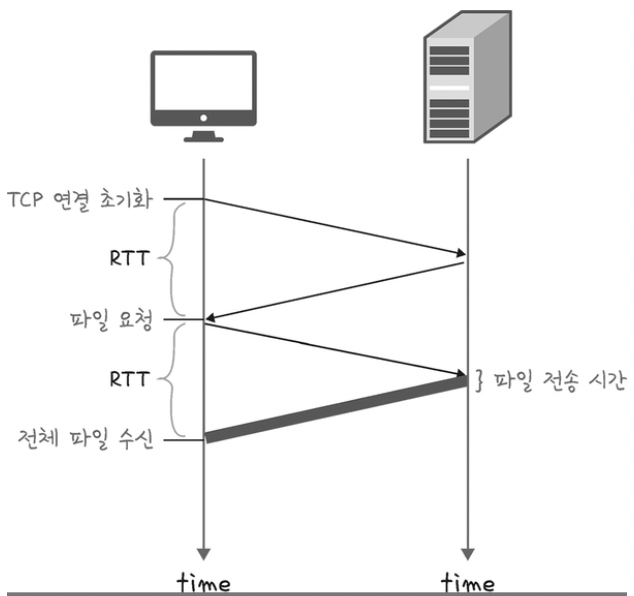
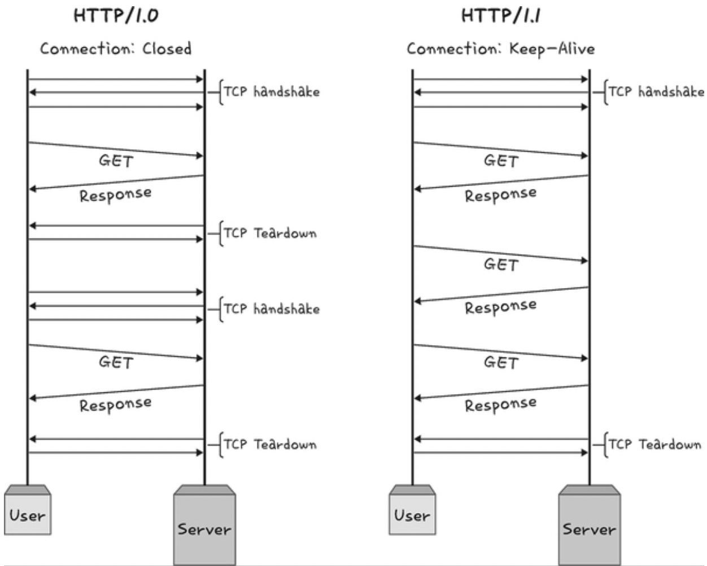
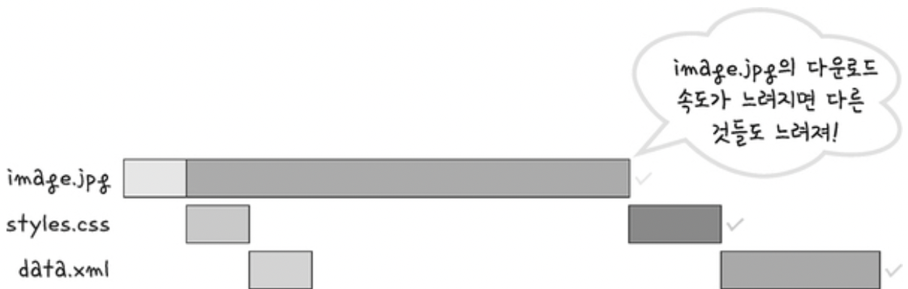
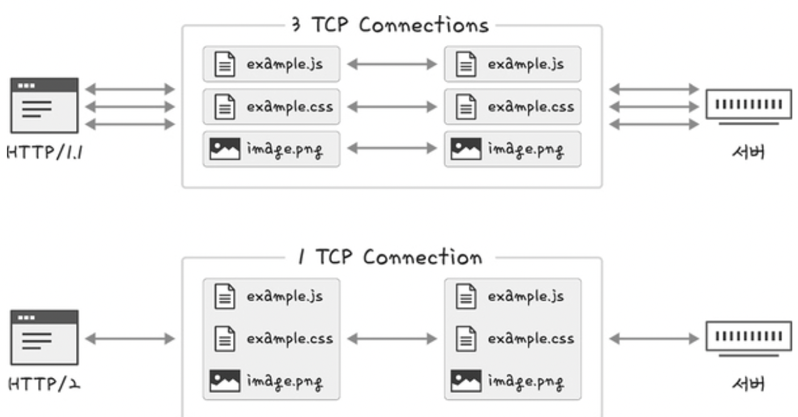
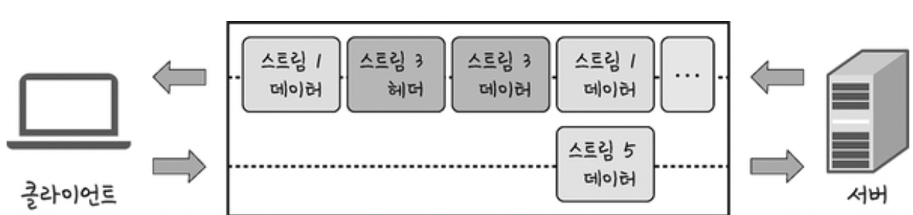
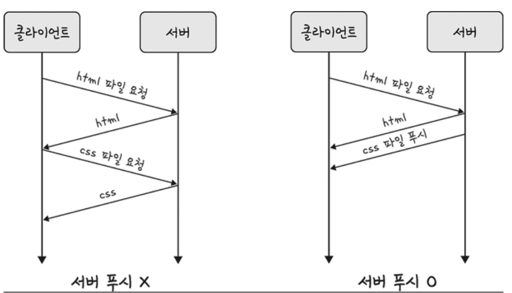
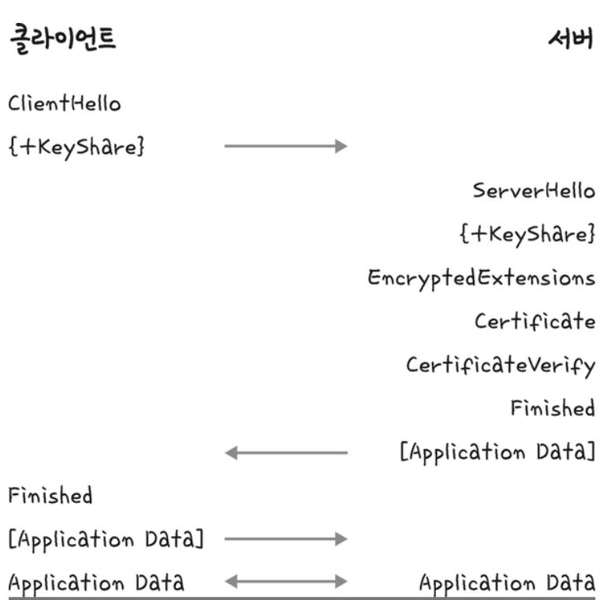
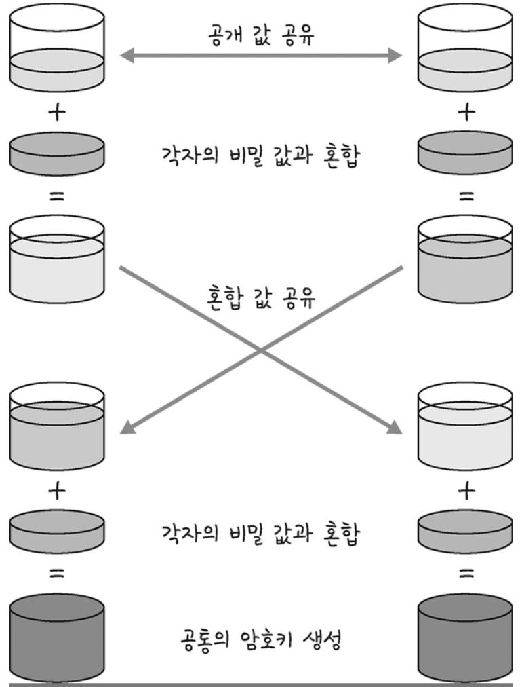
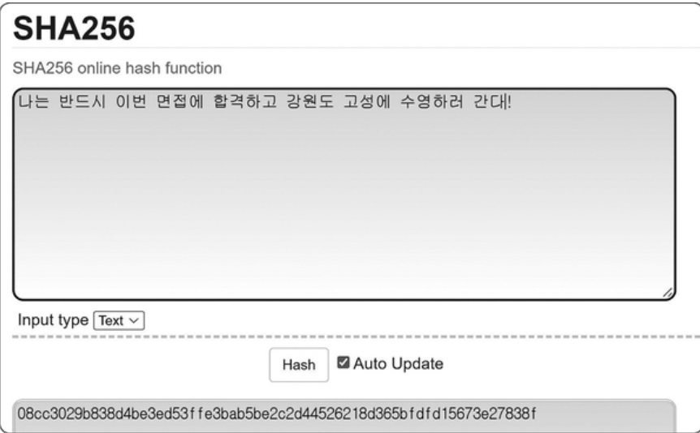
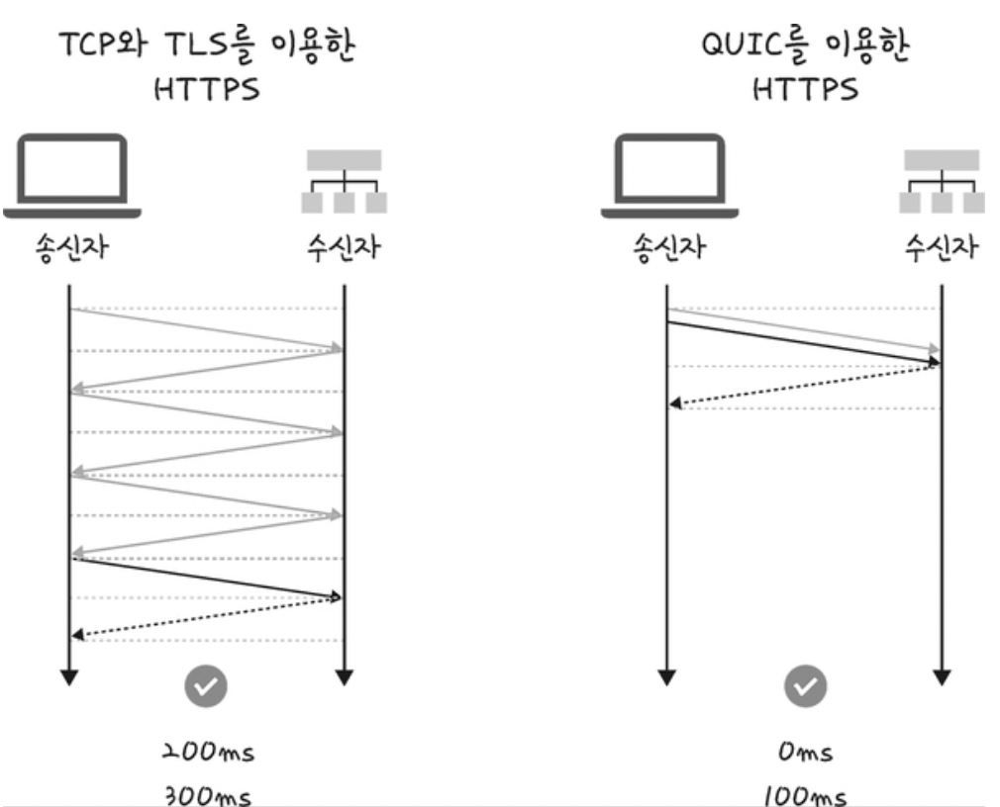

# HTTP
- 전송 계층 위에 있는 애플리케이션 계층
- 웹 서비스 통신에 사용

<br>

# HTTP의 종류

## HTTP/1.0

한 연결 당 하나의 요청을 처리하는 통신 방법

- 서버로부터 파일을 가져올 떄마다 3-웨이 핸드셰이크를 계속 열어야하기 때문에 RTT가 증가하는 단점

<br>

> ### RTT란
> 패킷이 목적지에 도달하고 나서 다시 출발지로 돌아오기까지 걸리는 시간 = 패킷 왕복 시간

<br>

### RTT의 증가를 해결하기 위한 방법


- 이미지 스플리팅 : 여러 이미지가 합쳐있는 이미지를 다운받고, background-position 을 사용해서 이미지를 표기

- 코드 압축 : 개행, 빈칸 삭제

- 이미지 Base64 인코딩 : 이미지를 문자열로 인코딩

<br>

## HTTP/1.1

한 번 TCP 초기화를 한 이후에 keep-alive라는 옵션으로 여러 개의 파일을 송수신할 수 있는 통신 방법

- 3-웨이 핸드셰이크가 한 번만 발생하고, 그다음부터는 발생하지 않는다.
- 다수의 리소스 처리 시, 요청할 리소스 개수에 비례해서 대기 시간이 길어지는 단점



<br>

### HOL Blocking

네트워크에서 같은 큐에 있는 패킷이 그 첫 번째 패킷에 의해 지연될 때 발생하는 성능 저하 현상



### 무거운 헤더 구조

1.1의 헤더에는 쿠키 등 많은 메타데이터가 압축되지 않고 들어있다.

<br>

## HTTP/2

- SPDY 프로토콜에서 파생된 HTTP/1.x보다 지연 시간을 줄이고 응답 시간을 더 빠르게 할 수 있다.
- 멀티플렉싱, 헤더 압축, 서버 푸시, 요청의 우선순위 처리를 지원하는 프로토콜

<br>

### 멀티 플렉싱

여러 개의 스트림을 사용하여 송수신하는 것



- 특정 스트림의 패킷이 손실돼도, 나머지 스트림은 영향 X

- 단일 연결을 사용하여 병렬로 여러 요청/응답이 가능
- HOL Blocking 해결 가능

<br>

> ### 스트림이란
> 시간이 지남에 따라 사용할 수 있게 되는 일련의 데이터 요소를 가리키는 데이터 흐름
> 
> 

<br>

### 헤더 압축

- 허프만 코딩 압축 알고리즘을 사용하여 HPACK 압축 형식을 가진다.

#### 허프만 코딩
문자열을 문자 단위로 쪼개 빈도수를 세어 빈도가 높은 정보는 적은 비트 수를 사용하여 표현하고 빈도가 낮은 정보는 비트수를 많이 사용하여 표현해서 데이터 표현에 필요한 비트양을 줄이는 원리

<br>

### 서버 푸시

- 클라이언트 요청 없이 서버가 바로 리소스를 푸시할 수 있다.



- html에 포함된 css 파일을 서버에서 푸시하여 클라이언트에 먼저 줄 수 있다.

<br>

## HTTPS

- HTTP/2는 HTTPS 위에서 동작
- 애플리케이션 계층과 전송 계층 사이에 신뢰 계층인 SSL/TLS 계층을 넣은 신뢰할 수 있는 HTTP 요청
- 통신을 암호화한다.

<br>

### SSL/TLS

전송 계층에서 보안을 제공하는 프로토콜

- 클라이언트와 서버가 통신할 때 SSL/TLS를 통해 제3자가 메시지를 도청하거나 변조하지 못하도록 한다.
- SSL/TLS는 보안 세션을 기반으로 데이터를 암호화하며 보안 세션이 만들어질 때 인증 메커니즘, 키 교환 암호화 알고리즘, 해싱 알고리즘이 사용
- 인터셉터 방지

<br>

### 보안 세션
- 보안이 시작되고 끝나는 동안 유지되는 세션을 말한다.
- SSL/TLS는 handshake를 통해 보안 세션을 생성하고 이를 기반으로 상태 정보등을 공유

<br>

> ### 세션이란
> 운영체제가 어떠한 사용자로부터 자신의 자산 이용을 허락하는 일정한 기간. 사용자는 일정 시간 동안 응용 프로그램, 자원 등을 사용할 수 있다.

<br>

### TLS의 핸드셰이크 


1. 클라이언트와 서버와 키를 공유
2. 인증, 인증 확인 등의 작업이 일어나는 1-RTT 생성
3. 클라이언트에서 사이퍼 슈트를 서버로 전달
4. 서버는 사이퍼슈트의 암호화 알고리즘 리스트 제공 가능 유무를 확인
5. 제공 가능하면 서버에서 클라이언트로 인증서를 보내는 인증 메커니즘이 시작
6. 해싱 알고리즘 등으로 암호화된 데이터의 송수신이 시작

<br>

### 암호화 알고리즘

키 교환 암호화 알고리즘으로는 대수곤선 기반의 ECDHE 또는 모듈 기반 DHE를 사용(둘다 디피-헬만 방식을 근간)

<br>

### 디피-헬만 키 교환 암호화 알고리즘
g와 x와 p를 안다면 y는 구하기 쉽지만 g와 y와 p만 안다면 x를 구하기는 어렵다는 원리에 기반한 알고리즘



<br>

### 해싱 알고리즘
- 데이터를 추정하기 힘든 더 작고, 섞여 있는 조각으로 만드는 알고리즘
- SSL/TLS는 해싱 알고리즘으로 SHA-256 알고리즘 사용


<br>

> ### 해시 & 해싱 & 해시함수
>
> ```해시```: 다양한 길이를 가진 데이터를 고정된 길이를 가진 데이터로 매핑(mapping)한 값
>
> ```해싱```: 임의의 데이터를 해시로 바꿔주는 일이며 해시 함수가 이를 담당
>
> ```해시함수```: 임의의 데이터를 입력으로 받아 일정한 길이의 데이터로 바꿔주는 함수

<br>

### HTTPS 구축 방법
1. CA에서 구매한 인증키를 기반으로 HTTPS 서비스를 구축
2. 서버 앞단의 HTTPS를 제공하는 로드밸런서를 두거나
3. 서버 앞단에 HTTPS를 제공하는 CDN을 둬서 구축

<br>

## HTTP/3

www에서 정보를 교환하는 데 사용되는 HTTP의 세 번째 버전

- QUIC 계층 위에서 돌아가며, UDP 기반

- HTTP/2의 장점인 멀티 플렉싱 + 초기 연결 설정 시 지연 시간 감소라는 장점

- UDP를 사용하기 때문에 TCP 3-웨이 핸드셰이크가 필요 없다는 장점

<br>



- RTT가 감소한다.

<br><br><br>

> ### Reference
> - 면접을 위한 CS 전공지식노트 (주홍철 저)